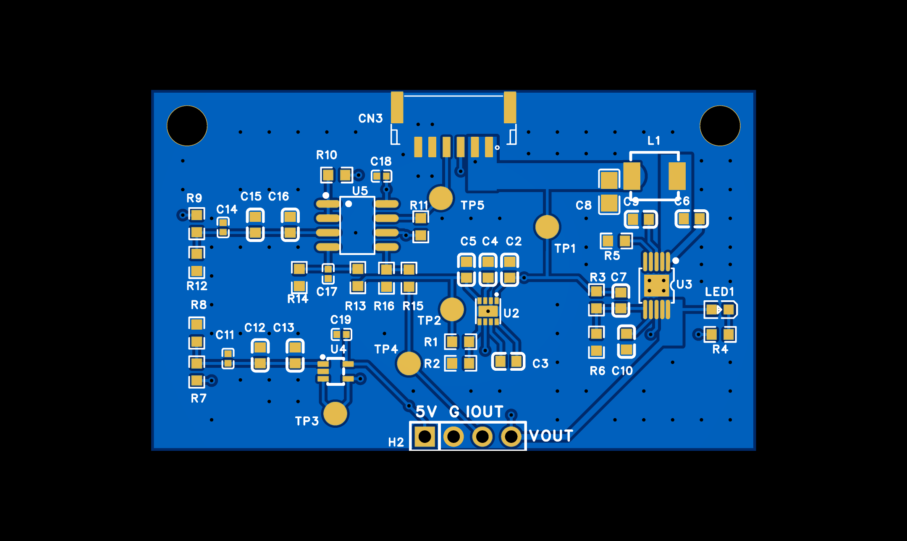
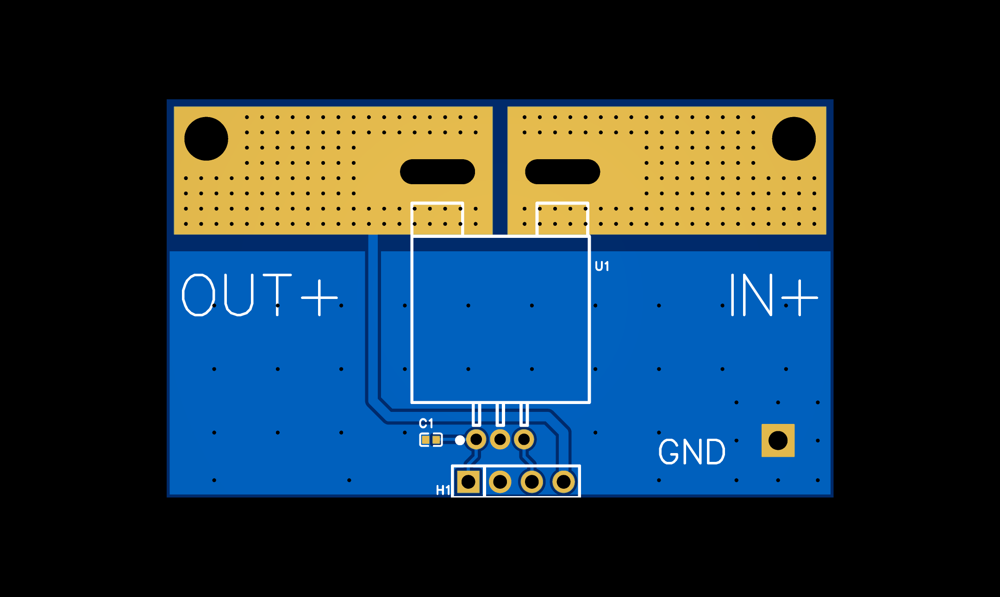
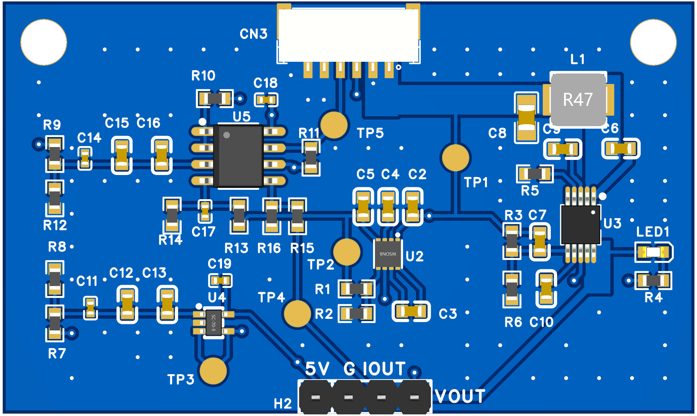
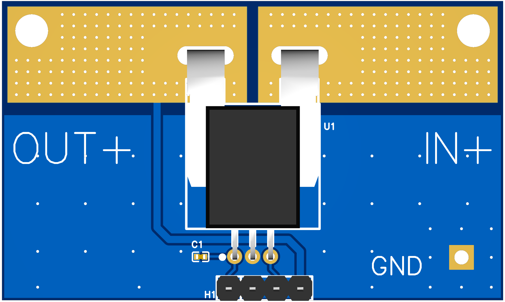

# 350a-hall-analog-power-meter
A custom power meter designed in EasyEDA, supporting currents up to 350A. It provides analog voltage and current outputs and includes a 5V synchronous buck converter for powering the Cube Orange+ flight controller. Developed for the [Starbound Team](https://starbound.e-ce.uth.gr/) for the 2026 [UAS challenge](https://www.imeche.org/events/challenges/uas-challenge). 
The PCB is split into two Gerber files (front and back) to avoid the cost of multiple designs in one PCB.

**2D Layout**
  

**3D View (with components)**
  

